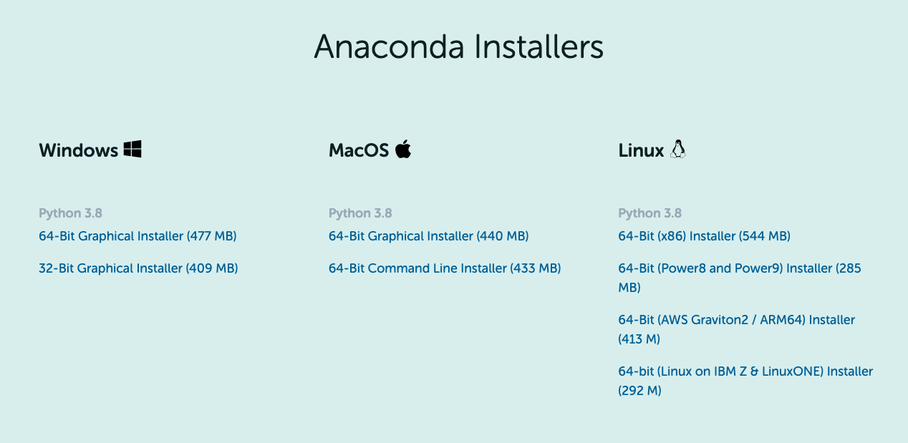

Installing Python
=================

In order to use dmtools, you will need to install the Python programming
language. We preface the Python installation instructions with a brief Q&A.
This section is ordered so that each answer naturally leads into the
following question so it is best read in order.

Q&A
---

`"What is Programming Language?"`

The purpose of a programming language is to allow us
to give instructions to a computer. At first, this may seem foreign. However,
every time you interact with a computer, you are giving it instructions to do
certain tasks like which website to navigate to, what document to open, etc..
The difference is in the way you are communicating that information. You are
most likely familiar with Graphical User Interfaces (`GUIs`_). These are
programs which provide graphical ways of giving the computer instructions using
the keyboard and mouse to point and click.

`"How does a programming language let us give instructions to a computer?"`

Without getting into too much detail, programming languages are just like
human languages. They have `syntax`_ which defines the structure of the
language and they have `semantics`_ which define the meaning of certain
structures in the language. Following these rules, we can write up a set of
instructions and it off to the computer to execute.

`"This sounds complicated. Why would I use this instead of a program with a nice GUI?"`

There are two main reasons: humans are lazy and flexibility. Often times, there
are tasks on the computer that are extremely repetitive. Unlike GUIs,
programming languages don't require the human to be very involved. We only need
to give the instructions once and the computer will go on chugging away until
we tell it to stop. In terms of flexibility, it may seem that programs like
Photoshop and Google Docs have an endless number of tabs, knobs, and dials but
their flexibility pales in comparison to programming languages. With a
programming language, the limit is quite literally, your imagination.

`"What is Python?"`

Yes, Python is a programming language. But, there are many different ways to
classify programming languages. There are many characteristics of Python but
the one we wish to emphasize here is that it is a general-purpose
`scripting language`_. Scripting languages "automate the execution of tasks
that would otherwise be performed individually by a human operator." It is
simple in that files written in the language can be run as scripts where the
computer just goes through the file linearly, executing each task as it is given.

..
   _TODO: Perhaps a better description of scripting language is needed.

Anaconda
--------

To install Python, we will use `Anaconda`_ which provides an extremely popular
Python distribution called `Anaconda Individual Edition`_. Navigate to the link
and scroll to the bottom to select the Anaconda Installer for your operating
system. Choose the Graphical Installer.

To verify you now have Python, open up a terminal (the Terminal Application on
macOS) and run ``python`` to open up a Python prompt (a place where Python
instructions can be run). The line beginning with ``>>>`` is where you can type
Python code and run it. Type ``print("Hello World!")`` and hit Enter. It
should display ``Hello World!`` as the result of the command! You can then type
``quit()`` or CTRL+D to exit the prompt.

.. code-block:: bash

    python
    Python 3.8.8 (default, Apr 13 2021, 12:59:45)
    [Clang 10.0.0 ] :: Anaconda, Inc. on darwin
    Type "help", "copyright", "credits" or "license" for more information.
    >>> print("Hello World!")
    Hello World!
    >>> quit()

You now have Python installed on your computer!

.. _GUIs: https://wikipedia.org/wiki/Graphical_user_interface
.. _syntax: https://wikipedia.org/wiki/Syntax_(programming_languages)
.. _semantics: https://wikipedia.org/wiki/Semantics_(computer_science)
.. _scripting language: https://wikipedia.org/wiki/Scripting_language
.. _Anaconda: https://www.anaconda.com/
.. _Anaconda Individual Edition: https://www.anaconda.com/products/individual-d
.. _Jupyter Notebook: https://jupyter.org/