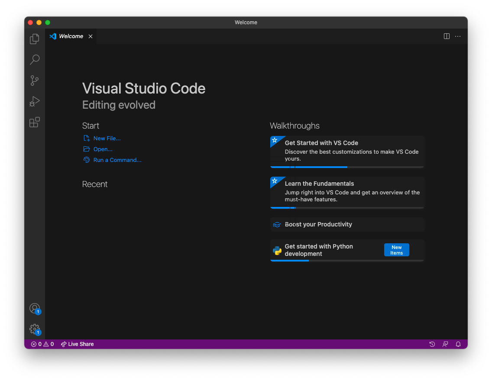
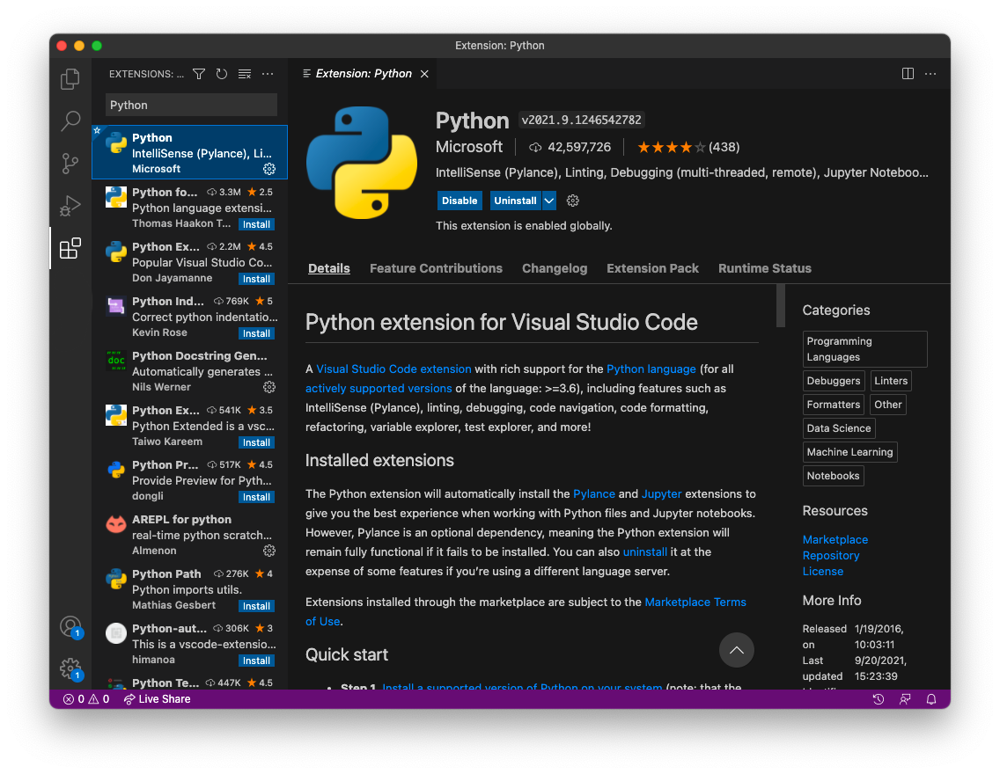
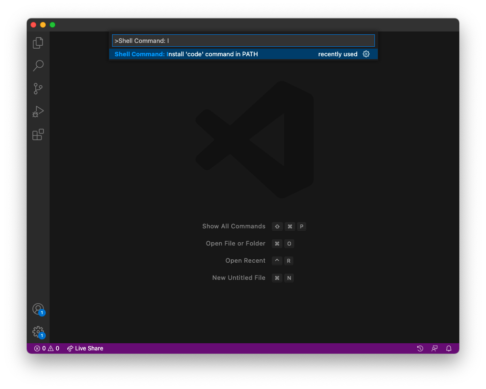

.. _vscode_tutorial:

Installing VS Code
==================

In :ref:`python_tutorial`, we will learn how to create Python scripts. We will
write these Python scripts in a text editor. On macOS, TextEdit is the default
text editor. However, you may want to use another text editor like
`VS Code`_ (recommended), `Notepad++`_, or `Vim`_. This tutorial walks through
the installation of VS Code in addition to a few nice extensions.

First, install `VS Code`_. Upon opening the application, the window will look
something like this.

We will install the `Python Extension`_ for VS Code. This provides "rich
support for the Python language." On the side bar, you will see a menu item
with four boxes. This is the extensions tab. Search for the Python extension
and install it.

Lastly, go to ``View > Command Palette`` and search for
``Shell Command: Install 'code' command in PATH``. Run this.

You have now successfully installed VS Code and are ready for the
:ref:`python_tutorial`!

.. _VS Code: https://code.visualstudio.com/
.. _Notepad++: https://notepad-plus-plus.org/
.. _Vim: https://www.vim.org/
.. _Python Extension: https://marketplace.visualstudio.com/items?itemName=ms-python.python
